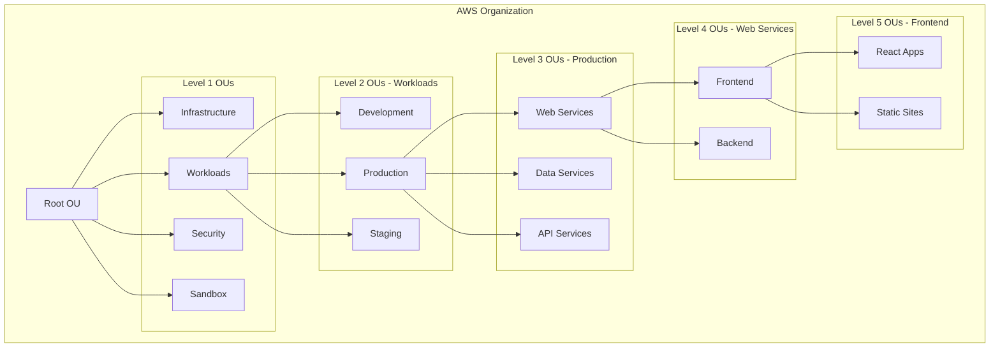
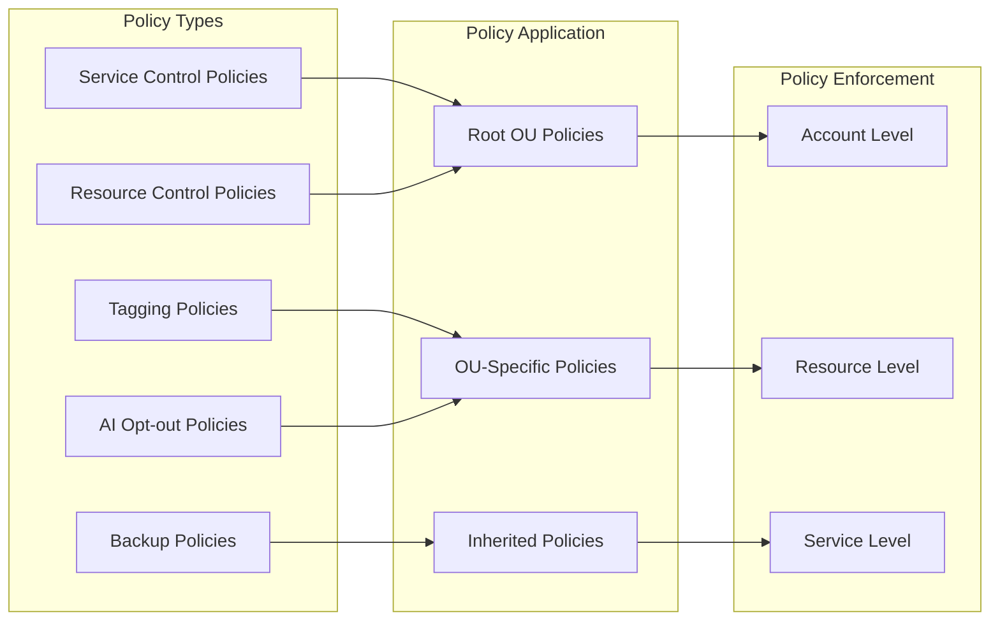
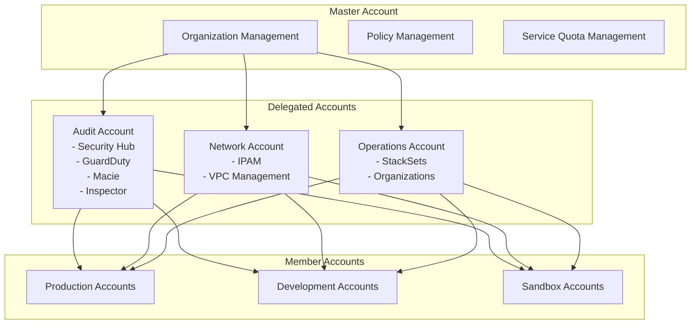

# Terraform AWS Organization Module

## Overview

The Terraform AWS Organization module provides a comprehensive, enterprise-grade solution for managing AWS Organizations with sophisticated governance, policy management, and service delegation capabilities. This module enables organizations to establish a well-structured, secure, and compliant AWS environment with centralized control and automated policy enforcement across all accounts and organizational units.

## Purpose & Intent

### **Problem Statement**

Large enterprises face significant challenges when managing multiple AWS accounts and establishing proper governance:

- **Fragmented Account Management**: Multiple AWS accounts without proper organizational structure or governance
- **Inconsistent Security Policies**: Lack of centralized policy enforcement across accounts and organizational units
- **Manual Governance Setup**: Time-consuming and error-prone manual configuration of organizational policies
- **Service Management Complexity**: Difficulty in managing AWS services across multiple accounts and regions
- **Compliance Challenges**: Lack of standardized tagging, backup, and resource control policies
- **Delegation Complexity**: Complex setup for delegating service management to specific accounts
- **Service Quota Management**: Inconsistent service quota management across the organization

### **Solution**

This module provides a centralized, automated approach to AWS Organization management that:

- **Centralizes Organization Structure**: Creates a hierarchical organizational unit structure with up to 5 levels of nesting
- **Automates Policy Management**: Implements Service Control Policies (SCPs), Tagging Policies, Backup Policies, Resource Control Policies, and AI Services Opt-out Policies
- **Enables Service Delegation**: Delegates management of critical AWS services to designated accounts
- **Manages Service Quotas**: Centralizes service quota management across the organization
- **Provides Governance Framework**: Establishes comprehensive governance and compliance controls
- **Reduces Operational Overhead**: Automates organizational setup and policy enforcement

## Key Features

### 🏗️ **Comprehensive Organization Management**

- **Hierarchical OU Structure**: Support for up to 5 levels of nested organizational units
- **Flexible Organization Design**: Configurable organizational structure with keys for easy reference
- **Account Management**: Integration with AWS account management and organizational structure
- **Root Organization Control**: Full control over the root organizational unit and its policies

### 📋 **Advanced Policy Management**

- **Service Control Policies (SCPs)**: Granular access control and permission management
- **Tagging Policies**: Standardized resource tagging across the organization
- **Backup Policies**: Centralized backup policy management and enforcement
- **Resource Control Policies**: Control over resource creation and management
- **AI Services Opt-out Policies**: Control over AI services usage across the organization
- **Policy Inheritance**: Automatic policy inheritance through organizational hierarchy

### 🔧 **Service Delegation & Management**

- **Delegated Administrators**: Delegate service management to specific accounts
- **Multi-Service Support**: Support for Organizations, StackSets, Access Analyzer, GuardDuty, Security Hub, Macie, Inspector, and IPAM
- **Service Principal Management**: Automatic service principal configuration
- **Service-Linked Roles**: Automated creation of required service-linked roles

### 📊 **Service Quota Management**

- **Centralized Quota Control**: Manage service quotas across the organization
- **Multi-Service Quotas**: Support for quotas across multiple AWS services
- **Regional Quota Management**: Proper handling of regional and global service quotas
- **Quota Monitoring**: Integration with AWS Service Quotas for monitoring and alerting

### 🛡️ **Security & Governance**

- **Least Privilege Access**: Granular control over service access and permissions
- **Policy Enforcement**: Automated enforcement of organizational policies
- **Compliance Framework**: Built-in compliance and governance controls
- **Audit Trail**: Comprehensive logging and monitoring capabilities

### ⚙️ **Operational Excellence**

- **Terraform State Management**: Full Terraform state management for all resources
- **Resource Tagging**: Consistent tagging across all created resources
- **Output Management**: Comprehensive outputs for integration with other modules
- **Dependency Management**: Proper resource dependencies and lifecycle management
- **Multi-Provider Support**: Support for multiple AWS providers and regions

## Architecture

### **Organizational Structure**



### **Policy Management Flow**



### **Service Delegation Architecture**



## Usage

### **Basic Usage - Simple Organization Structure**

```hcl
module "organization" {
  source = "appvia/organization/aws"
  version = "0.1.0"

  tags = {
    Environment = "production"
    ManagedBy   = "terraform"
    Purpose     = "organization"
  }

  organization = {
    units = [
      {
        name = "Infrastructure"
        key  = "infrastructure"
      },
      {
        name = "Workloads"
        key  = "workloads"
        units = [
          {
            name = "Development"
            key  = "workloads/development"
          },
          {
            name = "Production"
            key  = "workloads/production"
          }
        ]
      },
      {
        name = "Sandbox"
        key  = "sandbox"
      }
    ]
  }

  enable_aws_services = [
    "access-analyzer.amazonaws.com",
    "cloudtrail.amazonaws.com",
    "config.amazonaws.com",
    "guardduty.amazonaws.com",
    "securityhub.amazonaws.com",
    "sso.amazonaws.com"
  ]

  enable_policy_types = [
    "SERVICE_CONTROL_POLICY",
    "TAG_POLICY",
    "BACKUP_POLICY"
  ]
}
```

### **Advanced Usage - Enterprise Organization with Policies**

```hcl
module "organization" {
  source = "appvia/organization/aws"
  version = "0.1.0"

  tags = {
    Environment     = "production"
    BusinessUnit    = "IT"
    Compliance      = "required"
    DataClassification = "confidential"
  }

  # Organizational Structure
  organization = {
    units = [
      {
        name = "Infrastructure"
        key  = "infrastructure"
      },
      {
        name = "Workloads"
        key  = "workloads"
        units = [
          {
            name = "Development"
            key  = "workloads/development"
            units = [
              {
                name = "Web Services"
                key  = "workloads/development/web"
              },
              {
                name = "Data Services"
                key  = "workloads/development/data"
              }
            ]
          },
          {
            name = "Production"
            key  = "workloads/production"
            units = [
              {
                name = "Web Services"
                key  = "workloads/production/web"
                units = [
                  {
                    name = "Frontend"
                    key  = "workloads/production/web/frontend"
                  },
                  {
                    name = "Backend"
                    key  = "workloads/production/web/backend"
                  }
                ]
              },
              {
                name = "Data Services"
                key  = "workloads/production/data"
              }
            ]
          }
        ]
      },
      {
        name = "Security"
        key  = "security"
      },
      {
        name = "Sandbox"
        key  = "sandbox"
      }
    ]
  }

  # AWS Services Configuration
  enable_aws_services = [
    "access-analyzer.amazonaws.com",
    "account.amazonaws.com",
    "cloudtrail.amazonaws.com",
    "compute-optimizer.amazonaws.com",
    "config-multiaccountsetup.amazonaws.com",
    "config.amazonaws.com",
    "controltower.amazonaws.com",
    "cost-optimization-hub.bcm.amazonaws.com",
    "guardduty.amazonaws.com",
    "ram.amazonaws.com",
    "securityhub.amazonaws.com",
    "servicequotas.amazonaws.com",
    "sso.amazonaws.com",
    "tagpolicies.tag.amazonaws.com"
  ]

  enable_policy_types = [
    "AISERVICES_OPT_OUT_POLICY",
    "BACKUP_POLICY",
    "RESOURCE_CONTROL_POLICY",
    "SERVICE_CONTROL_POLICY",
    "TAG_POLICY"
  ]

  # Service Delegation
  enable_delegation = {
    organizations = {
      account_id = "123456789012" # Audit Account
    }
    securityhub = {
      account_id = "123456789012" # Audit Account
    }
    guardduty = {
      account_id = "123456789012" # Audit Account
    }
    macie = {
      account_id = "123456789012" # Audit Account
    }
    inspection = {
      account_id = "123456789012" # Audit Account
    }
    ipam = {
      account_id = "987654321098" # Network Account
    }
    stacksets = {
      account_id = "111111111111" # Operations Account
    }
  }

  # Service Control Policies
  service_control_policies = {
    "DenyRootActions" = {
      description = "Deny all actions for root user"
      content = jsonencode({
        Version = "2012-10-17"
        Statement = [
          {
            Effect = "Deny"
            Principal = "*"
            Action = "*"
            Resource = "*"
            Condition = {
              StringEquals = {
                "aws:PrincipalType" = "Root"
              }
            }
          }
        ]
      })
      key = "root"
    }

    "DenySandboxProduction" = {
      description = "Deny production resources in sandbox"
      content = jsonencode({
        Version = "2012-10-17"
        Statement = [
          {
            Effect = "Deny"
            Action = [
              "rds:*",
              "redshift:*",
              "elasticache:*"
            ]
            Resource = "*"
          }
        ]
      })
      key = "sandbox"
    }

    "DenyDevelopmentProduction" = {
      description = "Deny production resources in development"
      content = jsonencode({
        Version = "2012-10-17"
        Statement = [
          {
            Effect = "Deny"
            Action = [
              "rds:CreateDBInstance",
              "rds:ModifyDBInstance"
            ]
            Resource = "*"
            Condition = {
              StringEquals = {
                "rds:DatabaseClass" = "db.r5.24xlarge"
              }
            }
          }
        ]
      })
      key = "workloads/development"
    }
  }

  # Tagging Policies
  tagging_policies = {
    "MandatoryTags" = {
      description = "Enforce mandatory resource tagging"
      content = jsonencode({
        tags = {
          Environment = {
            tag_key = "Environment"
            tag_value = ["Development", "Staging", "Production"]
            enforce_for = ["ec2:instance", "s3:bucket", "rds:db"]
          }
          Owner = {
            tag_key = "Owner"
            tag_value = ["*"]
            enforce_for = ["ec2:instance", "s3:bucket", "rds:db"]
          }
          CostCenter = {
            tag_key = "CostCenter"
            tag_value = ["*"]
            enforce_for = ["ec2:instance", "s3:bucket", "rds:db"]
          }
        }
      })
      key = "root"
    }

    "ProductionTags" = {
      description = "Additional tags for production resources"
      content = jsonencode({
        tags = {
          DataClassification = {
            tag_key = "DataClassification"
            tag_value = ["Public", "Internal", "Confidential", "Restricted"]
            enforce_for = ["ec2:instance", "s3:bucket", "rds:db"]
          }
          BackupRequired = {
            tag_key = "BackupRequired"
            tag_value = ["true", "false"]
            enforce_for = ["ec2:instance", "s3:bucket", "rds:db"]
          }
        }
      })
      key = "workloads/production"
    }
  }

  # Backup Policies
  backup_policies = {
    "ProductionBackup" = {
      description = "Backup policy for production resources"
      content = jsonencode({
        rules = [
          {
            name = "ProductionBackupRule"
            target_backup_vault_name = "ProductionBackupVault"
            schedule_expression = "cron(0 2 * * ? *)"
            lifecycle = {
              delete_after_days = 90
              move_to_cold_storage_after_days = 30
            }
            recovery_point_tags = {
              Environment = "Production"
              BackupType = "Automated"
            }
          }
        ]
      })
      key = "workloads/production"
    }
  }

  # Resource Control Policies
  resource_control_policies = {
    "DenyUnapprovedRegions" = {
      description = "Deny resources in unapproved regions"
      content = jsonencode({
        Version = "2012-10-17"
        Statement = [
          {
            Effect = "Deny"
            Action = "*"
            Resource = "*"
            Condition = {
              StringNotEquals = {
                "aws:RequestedRegion" = ["us-east-1", "us-west-2", "eu-west-1"]
              }
            }
          }
        ]
      })
      key = "root"
    }
  }

  # AI Services Opt-out Policies
  ai_opt_out_policy = {
    "OptOutAI" = {
      description = "Opt out of AI services for sensitive workloads"
      content = jsonencode({
        Version = "2012-10-17"
        Statement = [
          {
            Effect = "Deny"
            Action = [
              "bedrock:*",
              "comprehend:*",
              "forecast:*",
              "personalize:*",
              "rekognition:*",
              "textract:*",
              "transcribe:*",
              "translate:*"
            ]
            Resource = "*"
          }
        ]
      })
      key = "workloads/production/data"
    }
  }
}

# Service Quotas Management
module "service_quotas" {
  source = "./modules/service_quotas"

  service_quotas = [
    {
      service_code = "ec2"
      quota_code   = "L-1216C47A" # Running On-Demand All G and VT instances
      value        = 100
    },
    {
      service_code = "ec2"
      quota_code   = "L-0263D0A3" # Running On-Demand F instances
      value        = 50
    },
    {
      service_code = "s3"
      quota_code   = "L-89B4F0A3" # Number of buckets
      value        = 1000
    },
    {
      service_code = "rds"
      quota_code   = "L-29A0A3C3" # DB instances
      value        = 200
    }
  ]

  providers = {
    aws = aws.us-east-1
  }
}
```

### **Use Cases**

#### **1. Enterprise Multi-Account Strategy**

```hcl
# For large enterprises with complex organizational structures
module "enterprise_organization" {
  source = "appvia/organization/aws"
  
  tags = {
    Environment = "production"
    BusinessUnit = "Enterprise"
    Compliance = "required"
  }

  organization = {
    units = [
      {
        name = "Core"
        key  = "core"
        units = [
          {
            name = "Security"
            key  = "core/security"
          },
          {
            name = "Networking"
            key  = "core/networking"
          },
          {
            name = "Shared Services"
            key  = "core/shared"
          }
        ]
      },
      {
        name = "Business Units"
        key  = "business"
        units = [
          {
            name = "Finance"
            key  = "business/finance"
          },
          {
            name = "Marketing"
            key  = "business/marketing"
          },
          {
            name = "Engineering"
            key  = "business/engineering"
          }
        ]
      }
    ]
  }

  enable_delegation = {
    securityhub = { account_id = "111111111111" }
    guardduty   = { account_id = "111111111111" }
    macie       = { account_id = "111111111111" }
    ipam        = { account_id = "222222222222" }
  }

  service_control_policies = {
    "EnterpriseGovernance" = {
      description = "Enterprise-wide governance controls"
      content = file("${path.module}/policies/enterprise-governance.json")
      key = "root"
    }
  }
}
```

#### **2. Compliance-Focused Organization**

```hcl
# For organizations with strict regulatory requirements
module "compliance_organization" {
  source = "appvia/organization/aws"
  
  tags = {
    Environment = "production"
    Compliance = "pci-dss"
    DataClassification = "confidential"
  }

  organization = {
    units = [
      {
        name = "PCI Environment"
        key  = "pci"
        units = [
          {
            name = "Cardholder Data Environment"
            key  = "pci/cde"
          },
          {
            name = "DMZ"
            key  = "pci/dmz"
          }
        ]
      },
      {
        name = "Non-PCI Environment"
        key  = "non-pci"
      }
    ]
  }

  service_control_policies = {
    "PCIDSSControls" = {
      description = "PCI DSS compliance controls"
      content = file("${path.module}/policies/pci-dss.json")
      key = "pci"
    }
  }

  tagging_policies = {
    "PCITagging" = {
      description = "PCI DSS tagging requirements"
      content = file("${path.module}/policies/pci-tagging.json")
      key = "pci"
    }
  }
}
```

#### **3. Development-Focused Organization**

```hcl
# For development and testing environments
module "dev_organization" {
  source = "appvia/organization/aws"
  
  tags = {
    Environment = "development"
    Purpose = "development"
  }

  organization = {
    units = [
      {
        name = "Development"
        key  = "development"
        units = [
          {
            name = "Feature Development"
            key  = "development/features"
          },
          {
            name = "Testing"
            key  = "development/testing"
          }
        ]
      },
      {
        name = "Staging"
        key  = "staging"
      }
    ]
  }

  service_control_policies = {
    "DevRestrictions" = {
      description = "Development environment restrictions"
      content = file("${path.module}/policies/dev-restrictions.json")
      key = "development"
    }
  }
}
```

## Monitoring & Troubleshooting

### **CloudWatch Logs and Metrics**

The module creates comprehensive monitoring capabilities:

```bash
# View organization structure
aws organizations list-organizational-units-for-parent --parent-id r-1234

# Check policy attachments
aws organizations list-policies-for-target --target-id ou-1234567890

# Monitor service delegation
aws organizations list-delegated-administrators

# Check service quotas
aws service-quotas get-service-quota --service-code ec2 --quota-code L-1216C47A
```

### **Key Monitoring Metrics**

| Service | Metric | Description | Use Case |
|---------|--------|-------------|----------|
| Organizations | `OrganizationEvents` | Organization management events | Monitor organizational changes |
| Policies | `PolicyAttachments` | Policy attachment events | Track policy enforcement |
| Service Quotas | `QuotaUtilization` | Service quota usage | Monitor quota consumption |
| Delegation | `DelegationEvents` | Service delegation events | Track delegation changes |

### **Common Issues & Solutions**

#### **1. Organizational Unit Creation Failures**

```
Error: Failed to create organizational unit
```

**Solutions**:

- Verify organizational unit names are unique within the parent
- Check for naming conflicts with existing OUs
- Ensure proper IAM permissions for Organizations service
- Verify the parent OU exists and is accessible

#### **2. Policy Attachment Issues**

```
Error: Policy attachment failed
```

**Solutions**:

- Verify policy content is valid JSON
- Check target OU exists and is accessible
- Ensure proper IAM permissions for policy management
- Verify policy type is enabled for the organization

#### **3. Service Delegation Failures**

```
Error: Service delegation failed
```

**Solutions**:

- Verify target account exists and is part of the organization
- Check service principal is enabled for the organization
- Ensure proper IAM permissions for delegation
- Verify service-linked roles are created

### **Operational Best Practices**

1. **Organizational Design**: Plan organizational structure before implementation
2. **Policy Management**: Use version control for policy documents
3. **Delegation Strategy**: Clearly define service ownership and delegation
4. **Quota Management**: Regularly review and update service quotas
5. **Monitoring**: Implement comprehensive monitoring and alerting

## Requirements

### **Prerequisites**

- AWS Organizations enabled
- Appropriate IAM permissions for Organizations service
- Target accounts for service delegation
- Service quotas configuration (if using service quotas)

### **AWS Services Used**

- AWS Organizations
- AWS Service Quotas
- AWS IAM (for service-linked roles)
- Various AWS services (for delegation)

### **Permissions Required**

- Organizations administrator
- IAM permissions for service-linked roles
- Service-specific permissions for delegation
- Service Quotas permissions (if using quotas)

### Organizational Units

You can defined your organizational units in the `organization` input variable. The `organization` input variable is an object with a list of units and accounts. Each unit can have a list of sub-units. The `organization` input variable defaults to an object with an empty list of units and accounts. An example is provided below

```hcl
organization = {
  units = [
    {
      name = "Infrastucture",
      key  = "infrastructure",
    },
    {
      name = "Workloads",
      key  = "workloads",
      units = [
        {
          name = "Development",
          key  = "workloads/development",
        },
        {
          name = "Production",
          key  = "workloads/production",
        },
      ]
    },
    {
      name = "Sandbox",
      key  = "sandbox",
    }
  ]

```

### Organizational Features

The `enable_aws_services` input variable is a list of AWS services to enable for the organization. The `enable_policy_types` input variable is a list of policy types to enable for the organization. The `enable_delegation` input variable provides the capability to delegate the management of a service to another AWS account. An example is provided below

```hcl
enable_aws_services = [
  "access-analyzer.amazonaws.com",
  "account.amazonaws.com",
  "cloudtrail.amazonaws.com",
  "compute-optimizer.amazonaws.com",
  "config-multiaccountsetup.amazonaws.com",
  "config.amazonaws.com",
  "controltower.amazonaws.com",
  "cost-optimization-hub.bcm.amazonaws.com",
  "guardduty.amazonaws.com",
  "ram.amazonaws.com",
  "securityhub.amazonaws.com",
  "servicequotas.amazonaws.com",
  "sso.amazonaws.com",
  "tagpolicies.tag.amazonaws.com"
]

enable_policy_types = [
  "AISERVICES_OPT_OUT_POLICY",
  "BACKUP_POLICY",
  "SERVICE_CONTROL_POLICY",
  "TAG_POLICY"
]

enable_delegation = {
  organizations = {
    account_name = "Audit"
  }
  securityhub = {
    account_name = "Audit"
  }
  guardduty = {
    account_name = "Audit"
  }
  ipam = {
    account_name = "Network"
  }
  macie = {
    account_name = "Audit"
  }
  inspection = {
    account_name = "Audit"
  }
}
```

### Service Control Policies

You can attach service control policies (SCPs) to the organization's root or to specific organizational units. The `service_control_policies` input variable is a map of SCPs to apply to the organization's root. The map key is the name of the SCP and the value is an object with the following attributes:

- `description` - A description for the SCP
- `content` - The content of the SCP
- `key` - If we created the organizational unit, this is the key to attach the policy to
- `target_id` - If the organizational unit already exists, this is the target ID to attach the policy to

An example where is have created the organizational units below

```
organization = {
  units = [
    {
      name = "Infrastucture",
      key  = "infrastructure",
    },
    {
      name = "Workloads",
      key  = "workloads",
      units = [
        {
          name = "Production",
          key  = "workloads/production",
        },
      ]
    }
  ]
}

## Checkout the basic example for more details
service_control_policies = {
  "DenyAll" = {
    description = "Deny all actions"
    content     = file("${path.module}/policies/deny-all.json")
    key         = "infrastructure"
  }
  "DenyProduction" = {
    description = "Deny all actions in the infrastructure unit"
    content     = file("${path.module}/policies/deny-infrastructure.json")
    key         = "infrastructure/production"
  }
}
```

Alternatively if the organizational unit already exists, you can attach the SCP to the target ID. An example is provided below

```
service_control_policies = {
  "DenyAll" = {
    description = "Deny all actions"
    content     = file("${path.module}/policies/deny-all.json")
    target_id   = "ou-123456789012"
  }
}
```

### Backup Policies

Backup policies can be attached to the organization's root or to specific organizational units. The `backup_policies` input variable is a map of backup policies to apply to the organization's root. The map key is the name of the backup policy and the value is an object with the following attributes:

- `description` - A description for the backup policy
- `content` - The content of the backup policy
- `key` - If we created the organizational unit, this is the key to attach the policy to
- `target_id` - If the organizational unit already exists, this is the target ID to attach the policy to

An example where is have created the organizational units below

```
organization = {
  units = [
    {
      name = "Infrastucture",
      key  = "infrastructure",
    }
  ]
}

backup_policies = {
  "BackupAll" = {
    description = "Backup all resources"
    content     = file("${path.module}/policies/backup-all.json")
    key         = "infrastructure"
    # target_id   = "ou-123456789012" # If the organizational unit already exists
  }
}
```

### Service Quotas

Service quotas can be applied to the organization. The `service_quotas` input variable is a collection of service quotas to apply to the organization. The collection is a list of objects with the following attributes:

- `service_code` - The service code of the service quota
- `quota_code` - The quota code of the service quota
- `value` - The value of the service quota

An example is provided below

```hcl
service_quotas = [
  {
    service_code = "ec2"
    quota_code   = "L-1216C47A"
    value        = 100
  }
]
```

Since AWS Service Quotas are not regional and only accessible from `us-east-1`, a `aws.us-east-1` provider must be defined and passed to the module. This is required regardless of whether you define any service quotas, as providers cannot be optional.

```hcl
provider "aws" {
  region = "us-east-1"
}

module "organization" {
  providers = {
    aws           = aws
    aws.us-east-1 = aws.us-east-1
  }
}
```

## Update Documentation

The `terraform-docs` utility is used to generate this README. Follow the below steps to update:

1. Make changes to the `.terraform-docs.yml` file
2. Fetch the `terraform-docs` binary (<https://terraform-docs.io/user-guide/installation/>)
3. Run `terraform-docs markdown table --output-file ${PWD}/README.md --output-mode inject .`

<!-- BEGIN_TF_DOCS -->
## Providers

| Name | Version |
|------|---------|
| <a name="provider_aws"></a> [aws](#provider\_aws) | >= 5.0.0 |

## Inputs

| Name | Description | Type | Default | Required |
|------|-------------|------|---------|:--------:|
| <a name="input_tags"></a> [tags](#input\_tags) | A map of tags to resources provisioned by this module. | `map(string)` | n/a | yes |
| <a name="input_ai_opt_out_policy"></a> [ai\_opt\_out\_policy](#input\_ai\_opt\_out\_policy) | A map of AI services opt-out policies to apply to the organization's root. | <pre>map(object({<br/>    description = string<br/>    # A description for the AI services opt-out policy<br/>    content = string<br/>    # The content of the AI services opt-out policy<br/>    key = optional(string)<br/>    # If we created the organizational unit, this is the key to attach the policy to<br/>    target_id = optional(string)<br/>    # If the organizational unit already exists, this is the target ID to attach the policy to<br/>  }))</pre> | `{}` | no |
| <a name="input_backup_policies"></a> [backup\_policies](#input\_backup\_policies) | A map of backup policies to apply to the organization's root. | <pre>map(object({<br/>    description = string<br/>    # A description for the backup policy<br/>    content = string<br/>    # The content of the backup policy<br/>    key = optional(string)<br/>    # If we created the organizational unit, this is the key to attach the policy to<br/>    target_id = optional(string)<br/>    # If the organizational unit already exists, this is the target ID to attach the policy to<br/>  }))</pre> | `{}` | no |
| <a name="input_enable_aws_services"></a> [enable\_aws\_services](#input\_enable\_aws\_services) | A list of AWS services to enable for the organization. | `list(string)` | <pre>[<br/>  "access-analyzer.amazonaws.com",<br/>  "account.amazonaws.com",<br/>  "cloudtrail.amazonaws.com",<br/>  "compute-optimizer.amazonaws.com",<br/>  "config-multiaccountsetup.amazonaws.com",<br/>  "config.amazonaws.com",<br/>  "controltower.amazonaws.com",<br/>  "cost-optimization-hub.bcm.amazonaws.com",<br/>  "guardduty.amazonaws.com",<br/>  "ram.amazonaws.com",<br/>  "securityhub.amazonaws.com",<br/>  "servicequotas.amazonaws.com",<br/>  "sso.amazonaws.com",<br/>  "tagpolicies.tag.amazonaws.com"<br/>]</pre> | no |
| <a name="input_enable_delegation"></a> [enable\_delegation](#input\_enable\_delegation) | Provides at the capability to delegate the management of a service to another AWS account. | <pre>object({<br/>    access_analyzer = optional(object({<br/>      account_id = string<br/>      # The id of the account to delegate the management of Access Analyzer to<br/>    }), null)<br/>    guardduty = optional(object({<br/>      account_id = string<br/>      # The id of the account to delegate the management of GuardDuty to<br/>    }), null)<br/>    inspection = optional(object({<br/>      account_id = string<br/>      # The id of the account to delegate the management of Inspector to<br/>    }), null)<br/>    ipam = optional(object({<br/>      account_id = string<br/>      # The id of the account to delegate the management of IPAM to<br/>    }), null)<br/>    macie = optional(object({<br/>      account_id = string<br/>      # The id of the account to delegate the management of Macie to<br/>    }), null)<br/>    organizations = optional(object({<br/>      account_id = string<br/>      # The id of the account to delegate the management of Organizations to<br/>    }), null)<br/>    securityhub = optional(object({<br/>      account_id = string<br/>      # The id of the account to delegate the management of Security Hub to<br/>    }), null)<br/>    stacksets = optional(object({<br/>      account_id = string<br/>      # The id of the account to delegate the management of StackSets to<br/>    }), null)<br/>  })</pre> | <pre>{<br/>  "access_analyzer": null,<br/>  "guardduty": null,<br/>  "inspection": null,<br/>  "ipam": null,<br/>  "macie": null,<br/>  "organizations": null,<br/>  "securityhub": null,<br/>  "stacksets": null<br/>}</pre> | no |
| <a name="input_enable_policy_types"></a> [enable\_policy\_types](#input\_enable\_policy\_types) | A list of policy types to enable for the organization. | `list(string)` | <pre>[<br/>  "AISERVICES_OPT_OUT_POLICY",<br/>  "BACKUP_POLICY",<br/>  "RESOURCE_CONTROL_POLICY",<br/>  "SERVICE_CONTROL_POLICY",<br/>  "TAG_POLICY"<br/>]</pre> | no |
| <a name="input_organization"></a> [organization](#input\_organization) | The organization with the tree of organizational units and accounts to construct. Defaults to an object with an empty list of units and accounts | <pre>object({<br/>    units = optional(list(object({<br/>      name = string,<br/>      key  = string,<br/>      units = optional(list(object({<br/>        name = string,<br/>        key  = string,<br/>        units = optional(list(object({<br/>          name = string,<br/>          key  = string,<br/>          units = optional(list(object({<br/>            name = string,<br/>            key  = string,<br/>            units = optional(list(object({<br/>              name = string,<br/>              key  = string,<br/>            })), [])<br/>          })), [])<br/>        })), [])<br/>      })), [])<br/>    })), [])<br/>  })</pre> | `{}` | no |
| <a name="input_resource_control_policies"></a> [resource\_control\_policies](#input\_resource\_control\_policies) | A map of resource control policies to apply to the organization's root. | <pre>map(object({<br/>    description = string<br/>    # A description for the resource control policy<br/>    content = string<br/>    # The content of the resource control policy<br/>    key = optional(string)<br/>    # If we created the organizational unit, this is the key to attach the policy to<br/>    target_id = optional(string)<br/>    # If the organizational unit already exists, this is the target ID to attach the policy to<br/>  }))</pre> | `{}` | no |
| <a name="input_service_control_policies"></a> [service\_control\_policies](#input\_service\_control\_policies) | A map of service control policies (SCPs) to apply to the organization's root. | <pre>map(object({<br/>    description = string<br/>    # A description for the service control policy<br/>    content = string<br/>    # The content of the service control policy<br/>    key = optional(string)<br/>    # If we created the organizational unit, this is the key to attach the policy to<br/>    target_id = optional(string)<br/>    # If the organizational unit already exists, this is the target ID to attach the policy to<br/>  }))</pre> | `{}` | no |
| <a name="input_tagging_policies"></a> [tagging\_policies](#input\_tagging\_policies) | A map of tagging policies to apply to the organization's root. | <pre>map(object({<br/>    description = string<br/>    # A description for the tagging policy<br/>    content = string<br/>    # The content of the tagging policy<br/>    key = optional(string)<br/>    # If we created the organizational unit, this is the key to attach the policy to<br/>    target_id = optional(string)<br/>    # If the organizational unit already exists, this is the target ID to attach the policy to<br/>  }))</pre> | `{}` | no |

## Outputs

| Name | Description |
|------|-------------|
| <a name="output_master_account_email"></a> [master\_account\_email](#output\_master\_account\_email) | The email address of the master account provided by AWS |
| <a name="output_master_account_id"></a> [master\_account\_id](#output\_master\_account\_id) | The ARN of the master account provided by AWS |
| <a name="output_organization_arn"></a> [organization\_arn](#output\_organization\_arn) | The ARN of the organization provided by AWS |
| <a name="output_organization_id"></a> [organization\_id](#output\_organization\_id) | The ID of the organization provided by AWS |
| <a name="output_organizational_units"></a> [organizational\_units](#output\_organizational\_units) | The organizational units created in the organization |
<!-- END_TF_DOCS -->

```

```
